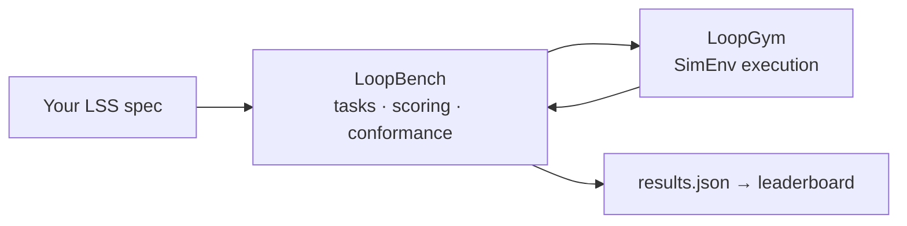

<div align="center">

# LoopBench

**The public scoreboard for loop engineering.**

Fixed tasks. Fixed seeds. Observed [LES](https://github.com/KanakMalpani/Loop-Core-Engineering/blob/main/specs/les-1.0.md). Submissions anyone can audit.

No hand-waved demos — bring an [LSS](https://github.com/KanakMalpani/Loop-Core-Engineering) spec, get a number, climb the leaderboard.

<br>

[](https://github.com/KanakMalpani/LoopBench/actions/workflows/test.yml)
[](https://pypi.org/project/loopbench/)
[](LICENSE)
[](tasks/)
[](SUITE-OVERVIEW.md)

<br>

```bash
pip install loopbench loopgym
loopbench list
```

<br>

[**Run your first score**](#score-in-2-minutes) · [**Leaderboard**](leaderboard/entries.json) · [**Suite overview**](SUITE-OVERVIEW.md)

<br>


</div>

---

## What LoopBench measures

You submit a **loop specification** (LSS YAML). LoopBench:

1. Runs it through [LoopGym](https://github.com/KanakMalpani/LoopGym) on fixed task instances
2. Computes **Success@k** and **LES_obs** across eight categories
3. Validates your `results.json` against a published schema
4. Ranks you on the public leaderboard

```bash
loopbench run --task LB-CR-1 --spec your-loop.yaml --seeds 0,1,2,3,4 -o results.json
loopbench validate results.json
loopbench rank leaderboard/entries.json
```

---

## The measurement stack



| Layer | Owns | Repo |
|-------|------|------|
| **Spec** | LSS schema, LES formulas | [Loop Core Engineering](https://github.com/KanakMalpani/Loop-Core-Engineering) |
| **Data** | Trajectories (holdout v0.2) | [LoopNet](https://github.com/KanakMalpani/loopnet) |
| **Runtime** | `env.run_episode()` | [LoopGym](https://github.com/KanakMalpani/LoopGym) |
| **Observability** | LTF traces, iteration metrics | [loop-observability](https://github.com/KanakMalpani/loop-observability) |
| **Measurement** | Tasks, LES_obs, anti-gaming | **LoopBench** |

LoopBench **defines** and **scores**. LoopGym **runs**. Never the other way around.

New to the stack? Start with the [LoopNet end-to-end tutorial](https://github.com/KanakMalpani/loopnet/blob/main/guides/END-TO-END-TUTORIAL.md).

---

## Tasks (v0.1)

| ID | Name | What it exposes |
|----|------|-----------------|
| **`LB-CR-1`** | Code repair | Can your loop fix broken code under verify pressure? |
| **`LB-RS-1`** | Research synthesis | Quality vs. cost on structured briefs |
| **`LB-MA-1`** | Multi-agent debate | Autonomy + coordination under evaluator scrutiny |

Five seeds per task. Details in [`tasks/`](tasks/).

---

## Score in 2 minutes

```bash
pip install loopbench loopgym

loopbench list

loopbench run \
  --task LB-CR-1 \
  --spec submissions/examples/spec-fast-loop.yaml \
  --seeds 0,1,2,3,4 \
  -o results.json

loopbench validate results.json
```

**Submit to the leaderboard:** open a PR adding your entry to [`leaderboard/entries.json`](leaderboard/entries.json).

v0.1 accepts **SimEnv** submissions only (fully reproducible, no API keys). LiveEnv tier: v0.2.

---

## Metrics explained

| Metric | Meaning |
|--------|---------|
| **Success@k** | Fraction of instances reaching goal threshold |
| **LES_obs** | Observed composite ∈ `[0, 1]` — [eight categories](metrics/les-compute.md) |
| **Cost** | Estimated USD from LSS cost limits |
| **Robustness** | Quality retention across seeds |

Display scale 0–100 is optional (`les × 100`).

---

## Who this is for

| You are… | LoopBench gives you… |
|----------|---------------------|
| **Loop designer** | A number you can improve release-over-release |
| **Framework author** | A neutral arena — not your own benchmark |
| **Researcher** | Reproducible tasks + published submission schema |
| **Team lead** | Comparable scores across designs and vendors |

---

## Citation

```bibtex
@software{loopbench2026,
  title={LoopBench: Benchmark Suite for Loop Engineering},
  author={Malpani, Kanak},
  year={2026},
  url={https://pypi.org/project/loopbench/}
}
```

<div align="center">

<sub>MIT · v0.1 · <a href="CONTRIBUTING.md">Contributing</a> · <a href="SECURITY.md">Security</a> · <a href="STATUS.md">Status</a></sub>

</div>
