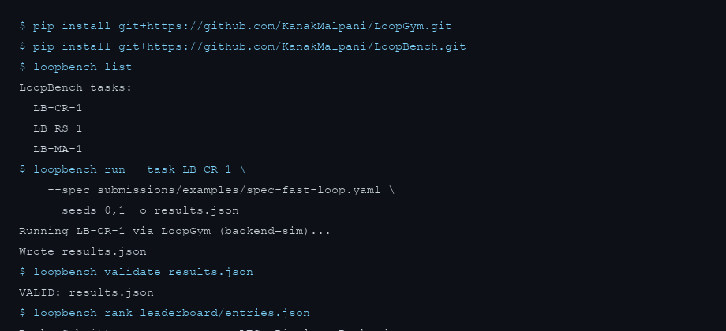
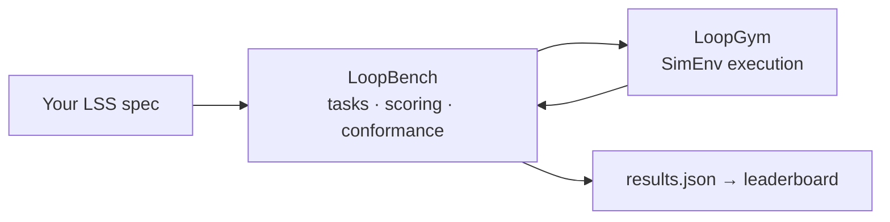

<div align="center">

# LoopBench

**The public scoreboard for loop engineering.**

Fixed tasks. Fixed seeds. Observed [LES](https://github.com/KanakMalpani/Loop-Core-Engineering/blob/main/specs/les-1.0.md). Submissions anyone can audit.

No hand-waved demos — bring an [LSS](https://github.com/KanakMalpani/Loop-Core-Engineering) spec, get a number, climb the leaderboard.

<br>

[](https://github.com/KanakMalpani/LoopBench/actions/workflows/test.yml)
[](https://pypi.org/project/loopbench/)
[](LICENSE)
[](tasks/)
[](SUITE-OVERVIEW.md)

<br>

```bash
pip install "le-loopforge>=0.2.0" "le-loopctl>=0.1.0" loopbench loopgym
loopbench list
loopbench suite list
```

<br>

[**Run your first score**](#score-in-2-minutes) · [**Live leaderboard**](https://kanakmalpani.github.io/LoopBench/) · [**Loop Playground**](https://github.com/KanakMalpani/Loop-Engineering/blob/main/contributions/LOOP_PLAYGROUND.md) · [**Leaderboard JSON**](leaderboard/entries.json) · [**Suite overview**](SUITE-OVERVIEW.md)

<br>



</div>

---

## What LoopBench measures

You submit a **loop specification** (LSS YAML). LoopBench:

1. Runs it through [LoopGym](https://github.com/KanakMalpani/LoopGym) on fixed task instances
2. Computes **Success@k** and **LES_obs** across eight categories
3. Validates your `results.json` against a published schema
4. Ranks you on the public leaderboard — **generalist** (grand composite) is the primary rank

```bash
loopbench run --suite suite-repair --spec your-loop.yaml --seeds 0,1,2,3,4 -o results.json
loopbench validate results.json
loopbench rank leaderboard/entries.json
loopbench rank leaderboard/entries.json --suite suite-repair
```

---

## The measurement stack



| Layer | Owns | Repo |
|-------|------|------|
| **Spec** | LSS schema, LES formulas | [Loop Core Engineering](https://github.com/KanakMalpani/Loop-Core-Engineering) |
| **Data** | Trajectories (holdout v0.2) | [LoopNet](https://github.com/KanakMalpani/loopnet) |
| **Runtime** | `env.run_episode()` | [LoopGym](https://github.com/KanakMalpani/LoopGym) |
| **Observability** | LTF traces, iteration metrics | [loop-observability](https://github.com/KanakMalpani/loop-observability) |
| **Measurement** | Tasks, LES_obs, anti-gaming | **LoopBench** |

LoopBench **defines** and **scores**. LoopGym **runs**. Never the other way around.

New to the stack? Start with the [LoopNet end-to-end tutorial](https://github.com/KanakMalpani/loopnet/blob/main/guides/END-TO-END-TUTORIAL.md).

---

## Suites and tasks (v0.2)

**19 micro-tasks** feed **4 comparison suites**. Primary leaderboard rank = **generalist** (mean of suite scores).

| Suite ID | Label | Micro-tasks |
|----------|-------|-------------|
| `suite-repair` | Repair & Verify | LB-CR-1, LB-REACT-1, LB-REFLEX-1, LB-OPT-1, LB-SAFE-1 |
| `suite-agent` | Multi-Agent | LB-MA-1, LB-CREW-1, LB-GRAPH-1, LB-TOT-1, LB-VOTE-1 |
| `suite-knowledge` | Research & RAG | LB-RS-1, LB-RAG-1, LB-BOOT-1, LB-AUTO-1 |
| `suite-rigor` | Composition & Safety | LB-COMP-1, LB-NEST-1, LB-SIM-1, LB-HITL-1, LB-MEM-1 |

```bash
loopbench suite list
loopbench run --suite suite-repair --spec your-loop.yaml --seeds 0,1,2,3,4 -o results.json
loopbench run --task LB-CR-1 --spec your-loop.yaml --seeds 0,1,2,3,4 -o results.json
```

Full catalog in [`tasks/index.yaml`](tasks/index.yaml) and [`SUITE-OVERVIEW.md`](SUITE-OVERVIEW.md).

## Live leaderboard

<!-- LEADERBOARD:START -->
<!-- auto-generated; do not edit -->
**Live board** (updated 2026-06-25) — [full rankings](leaderboard/LIVE.md)

**Generalist:**
- Loop Engineering maintainer — LES **86.7**
- Loop Engineering maintainer (MA-1) — LES **86.5**
- Team Thorough — LES **86.4**

[Submit your loop →](https://github.com/KanakMalpani/Loop-Engineering/blob/main/contributions/LOOP_PLAYGROUND.md)

<!-- LEADERBOARD:END -->

---

## Validate and reproduce

Post your **60-minute reproduction report** on the [reproduction challenge](https://github.com/KanakMalpani/Loop-Engineering/discussions/10) after [REPRODUCE.md](https://github.com/KanakMalpani/Loop-Engineering/blob/main/contributions/REPRODUCE.md).

### Beat maintainer LES (good-first #4)

**One command:** [BEAT_LB-CR-1.md](https://github.com/KanakMalpani/Loop-Engineering/blob/main/contributions/BEAT_LB-CR-1.md) — target LES_obs **≥ 86.7** on LB-CR-1.

Also: [BEAT_LB-RS-1.md](https://github.com/KanakMalpani/Loop-Engineering/blob/main/contributions/BEAT_LB-RS-1.md) (81.9) · [BEAT_LB-MA-1.md](https://github.com/KanakMalpani/Loop-Engineering/blob/main/contributions/BEAT_LB-MA-1.md) (86.5) · [BEAT_LB-COMP-1.md](https://github.com/KanakMalpani/Loop-Engineering/blob/main/contributions/BEAT_LB-COMP-1.md) (80.3)

```bash
pip install "le-loopforge>=0.2.0" "le-loopctl>=0.1.0" "loopbench>=0.2.0" "loopgym>=0.1.2"
# see BEAT_LB-CR-1.md for full clone + run + submit
```

---

## Score in 2 minutes

```bash
pip install "le-loopforge>=0.2.0" "le-loopctl>=0.1.0" loopbench loopgym

loopbench suite list

loopbench run \
  --suite suite-repair \
  --spec submissions/examples/spec-fast-loop.yaml \
  --seeds 0,1,2,3,4 \
  -o results.json

loopbench validate results.json
loopbench rank results.json
```

**Submit to the leaderboard:** open a PR adding your entry to [`leaderboard/entries.json`](leaderboard/entries.json).

v0.2 accepts **SimEnv** submissions (fully reproducible, no API keys). LiveEnv tier is optional.

---

## Metrics explained

| Metric | Meaning |
|--------|---------|
| **Success@k** | Fraction of instances reaching goal threshold |
| **LES_obs** | Observed composite ∈ `[0, 1]` — [eight categories](metrics/les-compute.md) |
| **Grand composite** | Mean of 4 suite scores — **generalist rank** |
| **Cost** | Estimated USD from LSS cost limits |
| **Robustness** | Quality retention across seeds |

Display scale 0–100 is optional (`les × 100`).

---

## Who this is for

| You are… | LoopBench gives you… |
|----------|---------------------|
| **Loop designer** | A number you can improve release-over-release |
| **Framework author** | A neutral arena — not your own benchmark |
| **Researcher** | Reproducible tasks + published submission schema |
| **Team lead** | Comparable scores across designs and vendors |

---

## Citation

```bibtex
@software{loopbench2026,
  title={LoopBench: Benchmark Suite for Loop Engineering},
  author={Malpani, Kanak},
  year={2026},
  url={https://pypi.org/project/loopbench/}
}
```

<div align="center">

<sub>MIT · v0.2 · <a href="CONTRIBUTING.md">Contributing</a> · <a href="SECURITY.md">Security</a> · <a href="STATUS.md">Status</a></sub>

</div>
