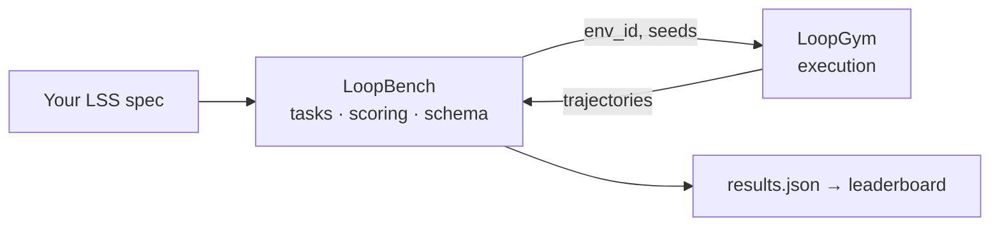

<p align="center">
  <strong>LoopBench</strong><br>
  <em>MLPerf for loops.</em>
</p>

<p align="center">
  <a href="https://github.com/KanakMalpani/LoopBench/actions/workflows/test.yml"></a>
  <a href="LICENSE"></a>
  
  <a href="SUITE-OVERVIEW.md"></a>
  
</p>

---

**LoopBench** is the public scoreboard for Loop Engineering — fixed tasks, fixed seeds, observed [LES](https://github.com/KanakMalpani/Loop-Core-Engineering/blob/main/specs/les-1.0.md), and a submission pipeline anyone can audit.

You bring an [LSS](https://github.com/KanakMalpani/Loop-Core-Engineering) loop spec. LoopBench runs it through [LoopGym](https://github.com/KanakMalpani/LoopGym), computes **LES_obs** across eight categories, validates your results JSON, and ranks you on the leaderboard. No hand-waved demos.

```bash
loopbench run --task LB-CR-1 --spec your-loop.yaml --seeds 0,1,2,3,4 -o results.json
loopbench validate results.json
```

<p align="center">
  <a href="#-run-your-first-score"><strong>Run your first score →</strong></a> ·
  <a href="leaderboard/entries.json">Leaderboard</a> ·
  <a href="SUITE-OVERVIEW.md">Suite architecture</a>
</p>

<p align="center">
  
</p>

---

## The contract



| Layer | Owns | Repo |
|-------|------|------|
| **Spec** | LSS schema, LES formulas | [Loop Core Engineering](https://github.com/KanakMalpani/Loop-Core-Engineering) |
| **Data** | Trajectories (optional holdout) | [LoopNet](https://github.com/KanakMalpani/loopnet) |
| **Runtime** | `env.run_episode()` | [LoopGym](https://github.com/KanakMalpani/LoopGym) |
| **Measurement** | Tasks, LES_obs, submissions | **LoopBench** |

LoopBench **defines** and **scores**. LoopGym **runs**. Never the other way around.

---

## ⚡ Run your first score

```bash
pip install git+https://github.com/KanakMalpani/LoopGym.git
pip install git+https://github.com/KanakMalpani/LoopBench.git

loopbench list

loopbench run \
  --task LB-CR-1 \
  --spec submissions/examples/spec-fast-loop.yaml \
  --seeds 0,1,2,3,4 \
  -o results.json

loopbench validate results.json
loopbench rank leaderboard/entries.json
```

**Local dev** (sibling clones):

```bash
git clone https://github.com/KanakMalpani/LoopGym.git
git clone https://github.com/KanakMalpani/LoopBench.git
cd LoopBench && pip install -e ../LoopGym -e ".[dev]"
```

On Windows: `py -3.12` if needed. PyPI: [PUBLISHING.md](PUBLISHING.md).

---

## Tasks (v0.1 · ALS v2)

| ID | Name | Env | What it stress-tests |
|----|------|-----|----------------------|
| `LB-CR-1` | Code repair | `loopbench/code-repair-v1` | Effectiveness, speed, robustness |
| `LB-RS-1` | Research synthesis | `loopbench/research-synthesis-v1` | Effectiveness, cost |
| `LB-MA-1` | Multi-agent debate | `loopbench/multi-agent-debate-v1` | Autonomy, scalability |

Each task ships YAML + README under [`tasks/`](tasks/). Five seeds by default. Success@k + **LES_obs** composite.

---

## Metrics

| Metric | Meaning |
|--------|---------|
| **Success@k** | Fraction of instances reaching goal threshold `g_target` |
| **LES_obs** | Observed eight-category composite ∈ `[0, 1]` — see [`metrics/les-compute.md`](metrics/les-compute.md) |
| **Cost** | Estimated USD per run from LSS cost limits |
| **Robustness** | Quality retention across seeds |

Display scale `0–100` is optional (`les_display = les_observed × 100`).

---

## Submit to the leaderboard

1. Run all tasks (or start with one):  
   `loopbench run --task LB-CR-1,LB-RS-1,LB-MA-1 --spec your-loop.yaml -o results.json`
2. Validate: `loopbench validate results.json`
3. Open a PR adding your entry to [`leaderboard/entries.json`](leaderboard/entries.json)

v0.1 rankings accept **SimEnv** submissions only (no API keys, fully reproducible). LiveEnv tier: v0.2.

---

## Repository layout

| Path | Purpose |
|------|---------|
| [`tasks/`](tasks/) | ALS v2 task definitions |
| [`metrics/les-compute.md`](metrics/les-compute.md) | LES_obs formulas |
| [`submit/schema.json`](submit/schema.json) | Submission JSON schema |
| [`loopbench/`](loopbench/) | Runner, LES compute, conformance |
| [`leaderboard/`](leaderboard/) | Public rankings (JSON v0.1) |
| [`submissions/examples/`](submissions/examples/) | Reference specs |

---

## Citation

```bibtex
@software{loopbench2026,
  title={LoopBench: Benchmark Suite for Loop Engineering},
  author={Malpani, Kanak},
  year={2026},
  url={https://github.com/KanakMalpani/LoopBench}
}
```

---

<p align="center">
  <sub>MIT · v0.1 · <a href="CONTRIBUTING.md">Contributing</a> · <a href="SECURITY.md">Security</a> · <a href="STATUS.md">Status</a></sub>
</p>
